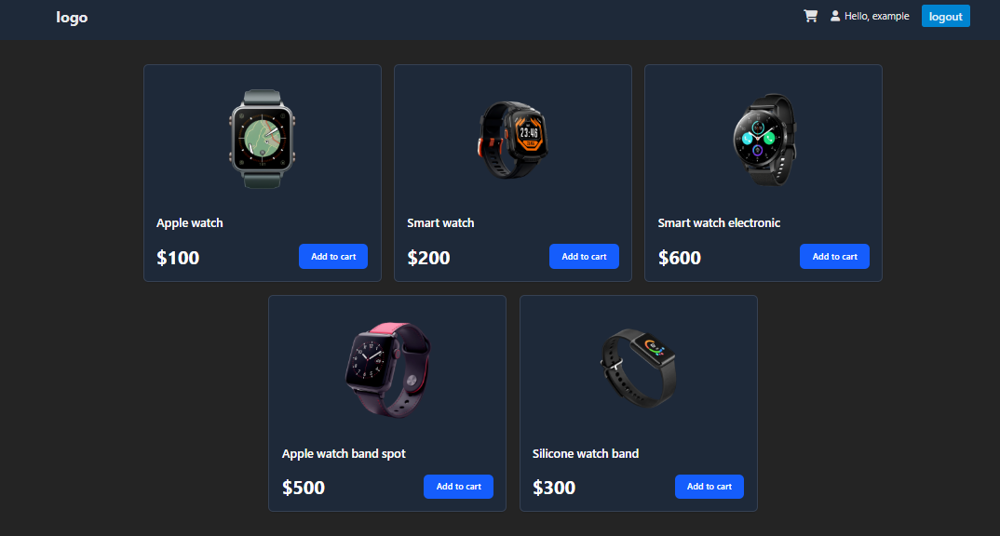
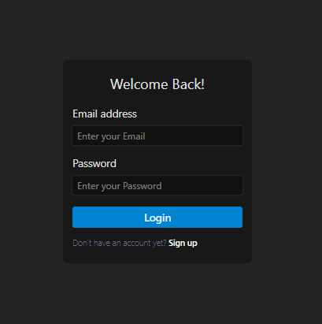
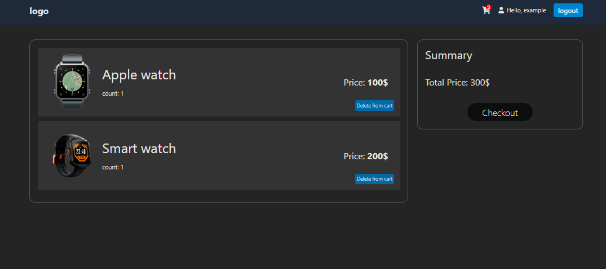

# 🛒 Shopping Cart Application



## 🚀 Overview

A modern shopping cart application built with vanilla javaScript, featuring a responsive design and seamless user experience. Users can browse products, manage their cart, and save all data using localStorage.

## ✨ Key Features

- Real-time cart updates
- Login and logout system
- Product filtering and search
- Responsive mobile-first design
- User authentication
- Order history tracking
- Saving all data with localStorage
- Dynamic and interactive product cart
- Successful message in login

## 🛠️ Technologies Used

- HTML
- CSS
- JavaScript
- Vite
- TailwindCSS

## 🔧 Installation

```bash
git clone https://github.com/AbdulrhmanSoliman/shopping-cart.git
cd shopping-cart
npm install
```

## 🏃‍♂️ Running the App

```bash
npm start
```

Visit `http://localhost:5173` in your browser.

## 📱 Screenshots




## 🤝 Contributing

1. Fork the repository
2. Create your feature branch (`git checkout -b feature/amazing-feature`)
3. Commit your changes (`git commit -m 'Add amazing feature'`)
4. Push to the branch (`git push origin feature/amazing-feature`)
5. Open a Pull Request

## 📝 License

MIT License - See [LICENSE](LICENSE) for details
